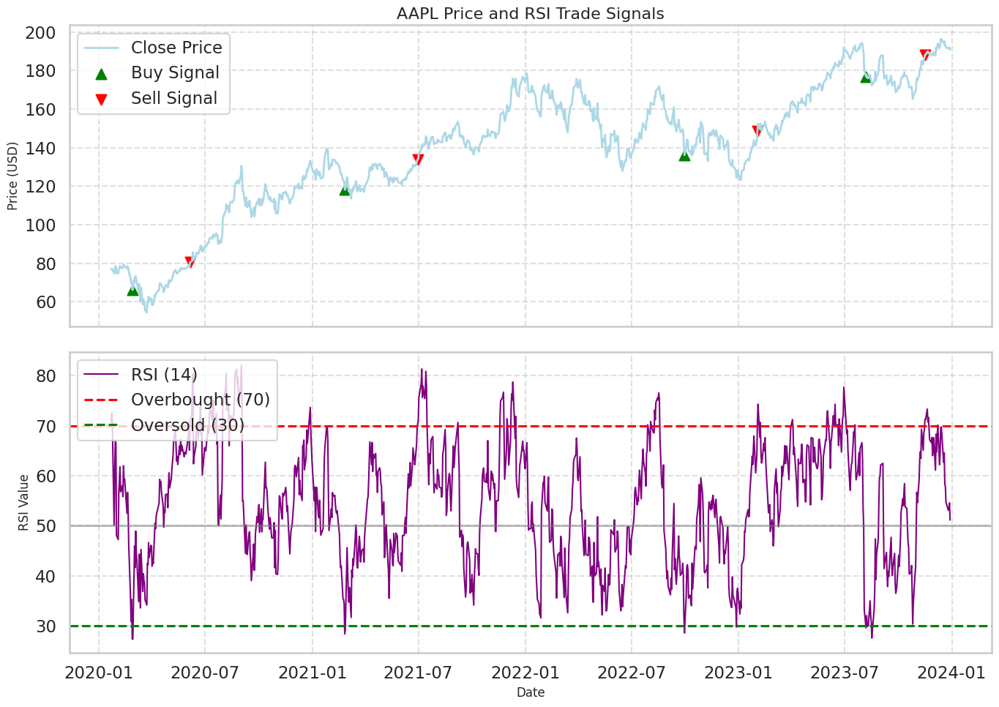
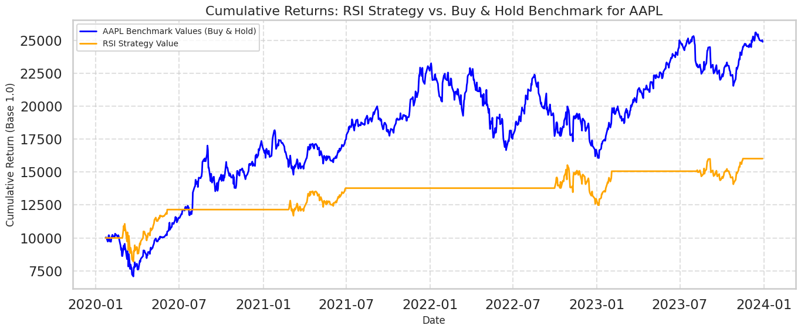
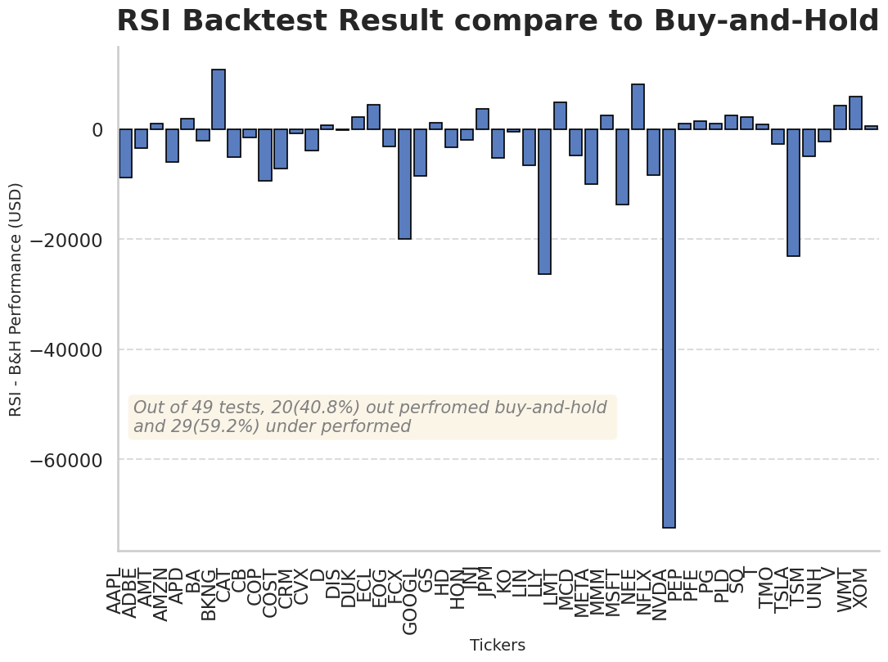

## 📈 Relative Strength Index (RSI) Backtesting Analysis

This project provides a comprehensive backtesting analysis of the **Relative Strength Index (RSI)** trading strategy. The analysis is performed within a **Jupyter Lab** environment and is structured into three main sections: **Data Preparation**, **Single Stock Visualization**, and **Multi-Stock Backtesting**.

The goal is to evaluate the performance of the classic RSI strategy (buying when RSI crosses below a lower threshold and selling when it crosses above an upper threshold) against a simple **Buy-and-Hold** strategy across a diverse set of stocks to derive generalized insights.

-----

## 🚀 Getting Started

### Prerequisites

You'll need the following installed:

  * **Python 3.7+**
  * **Jupyter Lab**
  * **Required Python libraries** (install via `pip`):
    ```bash
    pip install pandas numpy matplotlib mplfinance yfinance
    ```

### Repository Structure

```
RSI_backtest/
├── RSI_Analysis.ipynb        # Main Jupyter Notebook for the analysis
├── README.md                 # This file
├── images/                   # Directory for storing graphs
└── data/                     # Directory for storing downloaded stock data (optional)
```

### Usage

1.  **Clone the repository:**
    ```bash
    git clone https://github.com/yourusername/RSI_Backtesting_Analysis.git
    cd RSI_Backtesting_Analysis
    ```
2.  **Launch Jupyter Lab:**
    ```bash
    jupyter lab
    ```
3.  **Open and run the `RSI_Analysis.ipynb` notebook.** The notebook is divided into the three analytical sections described below.

-----

## 1\. Gather and Select Data

This section of the notebook focuses on acquiring and preparing the necessary financial data.

  * **Data Source:** Uses the `yfinance` library to download historical stock data (OHLCV - Open, High, Low, Close, Volume) from Yahoo Finance.
  * **Timeframe:** You can specify the desired time range (e.g., '5y' for 5 years) and interval (e.g., '1d' for daily data).
  * **Data Selection:** The analysis primarily uses the **Adjusted Close** price for calculations and trading logic, as it accounts for corporate actions like splits and dividends. The **Volume** data may also be gathered but is not essential for the core RSI calculation.
  * **RSI Calculation:** The 14-period RSI is calculated using standard financial libraries or formulas.

-----

## 2\. Visualize Single Stock Performance

This section provides an in-depth visual breakdown of the RSI strategy for a single, selected stock (e.g., AAPL).

  * **Chart 1: Signal Visualization**
      * Displays the stock's **Adjusted Close Price** and the **RSI line** (typically a 14-period RSI) on separate subplots.
      * Highlights the **RSI Overbought (e.g., 70)** and **Oversold (e.g., 30)** thresholds.
      * Plots the specific **Buy (green circle)** and **Sell (red circle)** signals generated by the RSI strategy on the price chart.


  * **Chart 2: Strategy Comparison**
      * Compares the **Cumulative Returns** of the **RSI Strategy** against the **Buy-and-Hold Strategy** for the same stock over the same period.
      * This comparison helps to visually assess the profitability and drawdowns of the RSI strategy relative to the market benchmark.


-----

## 3\. Multi-Stock Backtesting and Generalization

The final, crucial step is to backtest the RSI strategy on a **portfolio of multiple stocks** (e.g., stocks from the S\&P 500) to ensure the results are not attributable to one "lucky" stock.

### Backtesting Methodology

1.  **Strategy Rules:**
      * **Buy Signal:** RSI crosses *below* the oversold threshold (e.g., 30).
      * **Sell Signal:** RSI crosses *above* the overbought threshold (e.g., 70).
2.  **Assumptions:** The analysis typically assumes no transaction costs, full deployment of capital on each trade, and execution at the next day's opening price following a signal.


